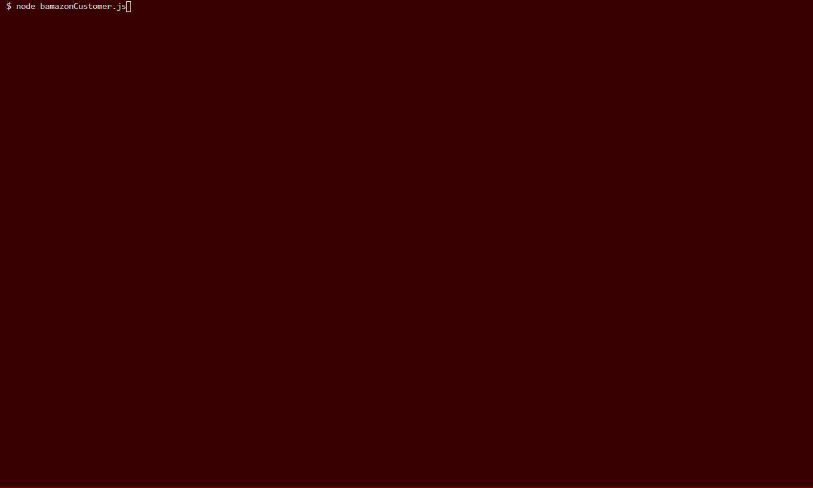

# Bamazon - Command Line Node App

## Overview
This app is a mock online store. 
 
When the app is ran it will first ask the user if they would like to shop with us.
## Inquier Prompts
 
### 1st Question
 
Type in the id# of the fish you would like to purchase?
 
### 2nd Question
 
Type in the id# of the fish you would like to purchase.
 
### 3rd Question
 
How many fish would you like to buy?
 
 

 
 
## How to Use
Start App with node bamazonCustomer.js.

## NPMs Used
[inquirer](https://www.npmjs.com/package/i) 
 
[chalk](https://www.npmjs.com/package/chalk) 
 
[figlet](https://www.npmjs.com/package/figlet) 
 
[mysql](https://www.npmjs.com/package/mysql)
 
[DotEnv](https://www.npmjs.com/package/dotenv) 
 

## What You Need To Run The App

inside of the .env file
